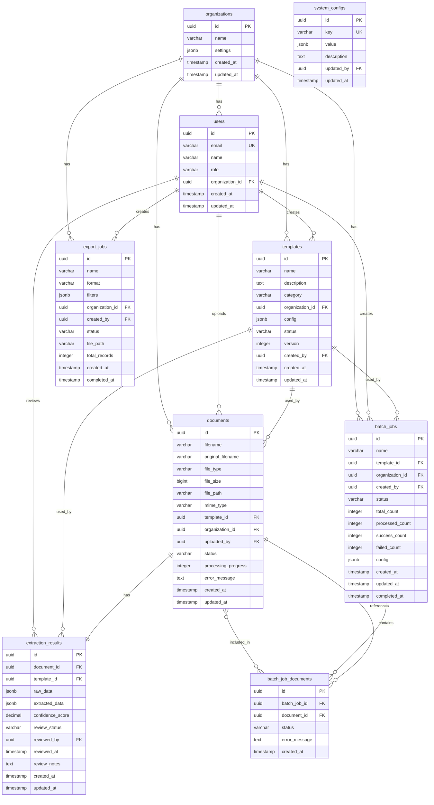

# 数据库设计文档

## 1. 数据库ER图



## 2. 数据表详细设计

### 2.1 organizations (组织表)

| 字段名 | 类型 | 约束 | 说明 |
|--------|------|------|------|
| id | UUID | PRIMARY KEY | 组织ID |
| name | VARCHAR(255) | NOT NULL | 组织名称 |
| settings | JSONB | | 组织级别配置（存储限制、功能开关等） |
| created_at | TIMESTAMP | DEFAULT NOW() | 创建时间 |
| updated_at | TIMESTAMP | DEFAULT NOW() | 更新时间 |

**索引**:
- PRIMARY KEY (id)

**示例settings字段**:
```json
{
  "maxFileSize": 104857600,
  "allowedFileTypes": ["pdf", "image", "word", "excel"],
  "maxDocumentsPerMonth": 10000,
  "features": {
    "aiExtraction": true,
    "batchProcessing": true,
    "apiAccess": true
  }
}
```

### 2.2 users (用户表)

| 字段名 | 类型 | 约束 | 说明 |
|--------|------|------|------|
| id | UUID | PRIMARY KEY | 用户ID |
| email | VARCHAR(255) | UNIQUE, NOT NULL | 邮箱（登录账号） |
| name | VARCHAR(100) | | 用户姓名 |
| role | VARCHAR(50) | DEFAULT 'user' | 角色：admin, user, viewer |
| organization_id | UUID | FOREIGN KEY | 所属组织 |
| created_at | TIMESTAMP | DEFAULT NOW() | 创建时间 |
| updated_at | TIMESTAMP | DEFAULT NOW() | 更新时间 |

**索引**:
- PRIMARY KEY (id)
- UNIQUE (email)
- INDEX (organization_id)

**角色说明**:
- `admin`: 管理员，可管理组织内所有资源
- `user`: 普通用户，可创建模板、上传文档、查看结果
- `viewer`: 只读用户，只能查看结果

### 2.3 templates (模板表)

| 字段名 | 类型 | 约束 | 说明 |
|--------|------|------|------|
| id | UUID | PRIMARY KEY | 模板ID |
| name | VARCHAR(255) | NOT NULL | 模板名称 |
| description | TEXT | | 模板描述 |
| category | VARCHAR(100) | | 类别：发票、火车票、报销单等 |
| organization_id | UUID | FOREIGN KEY | 所属组织 |
| config | JSONB | NOT NULL | 模板配置（字段定义、提取规则等） |
| status | VARCHAR(50) | DEFAULT 'draft' | 状态：draft, active, archived |
| version | INTEGER | DEFAULT 1 | 版本号 |
| created_by | UUID | FOREIGN KEY | 创建者 |
| created_at | TIMESTAMP | DEFAULT NOW() | 创建时间 |
| updated_at | TIMESTAMP | DEFAULT NOW() | 更新时间 |

**索引**:
- PRIMARY KEY (id)
- INDEX (organization_id, status)
- INDEX (category)

**config字段结构示例**:
```json
{
  "documentType": "train_ticket",
  "fields": [
    {
      "id": "field_1",
      "name": "乘车人",
      "type": "text",
      "required": true,
      "extraction": {
        "method": "hybrid",
        "prompt": "提取乘车人姓名",
        "position": {
          "x": 100,
          "y": 200,
          "width": 200,
          "height": 30
        },
        "regex": null
      },
      "validation": {
        "type": "custom",
        "rule": "length > 0"
      }
    },
    {
      "id": "field_2",
      "name": "车次",
      "type": "text",
      "required": true,
      "extraction": {
        "method": "regex",
        "prompt": null,
        "position": null,
        "regex": "G\\d+|D\\d+|K\\d+|T\\d+|Z\\d+"
      }
    },
    {
      "id": "field_3",
      "name": "出发地",
      "type": "text",
      "required": true,
      "extraction": {
        "method": "ai",
        "prompt": "提取出发站名称",
        "position": null,
        "regex": null
      }
    },
    {
      "id": "field_4",
      "name": "到达地",
      "type": "text",
      "required": true,
      "extraction": {
        "method": "ai",
        "prompt": "提取到达站名称",
        "position": null,
        "regex": null
      }
    },
    {
      "id": "field_5",
      "name": "乘车时间",
      "type": "datetime",
      "required": true,
      "extraction": {
        "method": "regex",
        "prompt": null,
        "position": null,
        "regex": "\\d{4}-\\d{2}-\\d{2} \\d{2}:\\d{2}"
      },
      "validation": {
        "type": "date",
        "format": "YYYY-MM-DD HH:mm"
      }
    }
  ],
  "layout": {
    "width": 800,
    "height": 600,
    "annotations": []
  }
}
```

### 2.4 documents (文档表)

| 字段名 | 类型 | 约束 | 说明 |
|--------|------|------|------|
| id | UUID | PRIMARY KEY | 文档ID |
| filename | VARCHAR(500) | NOT NULL | 存储文件名 |
| original_filename | VARCHAR(500) | NOT NULL | 原始文件名 |
| file_type | VARCHAR(50) | | 文件类型：pdf, image, word, excel |
| file_size | BIGINT | | 文件大小（字节） |
| file_path | VARCHAR(1000) | | 存储路径 |
| mime_type | VARCHAR(100) | | MIME类型 |
| template_id | UUID | FOREIGN KEY | 使用的模板 |
| organization_id | UUID | FOREIGN KEY | 所属组织 |
| uploaded_by | UUID | FOREIGN KEY | 上传者 |
| status | VARCHAR(50) | DEFAULT 'pending' | 状态：pending, processing, completed, failed, reviewed |
| processing_progress | INTEGER | DEFAULT 0 | 处理进度（0-100） |
| error_message | TEXT | | 错误信息 |
| created_at | TIMESTAMP | DEFAULT NOW() | 创建时间 |
| updated_at | TIMESTAMP | DEFAULT NOW() | 更新时间 |

**索引**:
- PRIMARY KEY (id)
- INDEX (organization_id, status)
- INDEX (template_id)
- INDEX (uploaded_by)
- INDEX (created_at)

**状态说明**:
- `pending`: 待处理
- `processing`: 处理中
- `completed`: 处理完成
- `failed`: 处理失败
- `reviewed`: 已审核

### 2.5 extraction_results (解析结果表)

| 字段名 | 类型 | 约束 | 说明 |
|--------|------|------|------|
| id | UUID | PRIMARY KEY | 结果ID |
| document_id | UUID | FOREIGN KEY, UNIQUE | 文档ID（一对一） |
| template_id | UUID | FOREIGN KEY | 使用的模板 |
| raw_data | JSONB | | OCR原始结果 |
| extracted_data | JSONB | NOT NULL | 提取的结构化数据 |
| confidence_score | DECIMAL(5,4) | | 整体置信度（0-1） |
| review_status | VARCHAR(50) | DEFAULT 'pending' | 审核状态：pending, approved, rejected, needs_review |
| reviewed_by | UUID | FOREIGN KEY | 审核者 |
| reviewed_at | TIMESTAMP | | 审核时间 |
| review_notes | TEXT | | 审核备注 |
| created_at | TIMESTAMP | DEFAULT NOW() | 创建时间 |
| updated_at | TIMESTAMP | DEFAULT NOW() | 更新时间 |

**索引**:
- PRIMARY KEY (id)
- UNIQUE (document_id)
- INDEX (template_id)
- INDEX (review_status)
- INDEX (confidence_score)

**extracted_data字段结构示例**:
```json
{
  "field_1": {
    "value": "张三",
    "confidence": 0.95,
    "source": "hybrid",
    "rawText": "乘车人：张三",
    "bbox": {
      "x": 100,
      "y": 200,
      "width": 200,
      "height": 30
    }
  },
  "field_2": {
    "value": "G123",
    "confidence": 0.98,
    "source": "regex",
    "rawText": "G123次",
    "bbox": {
      "x": 150,
      "y": 250,
      "width": 100,
      "height": 25
    }
  },
  "field_3": {
    "value": "北京",
    "confidence": 0.92,
    "source": "ai",
    "rawText": "出发站：北京",
    "bbox": null
  },
  "field_4": {
    "value": "上海",
    "confidence": 0.90,
    "source": "ai",
    "rawText": "到达站：上海",
    "bbox": null
  },
  "field_5": {
    "value": "2024-01-15 08:30",
    "confidence": 0.88,
    "source": "regex",
    "rawText": "2024-01-15 08:30",
    "bbox": {
      "x": 200,
      "y": 300,
      "width": 150,
      "height": 25
    }
  }
}
```

**raw_data字段结构示例**:
```json
{
  "text": "完整的OCR识别文本...",
  "words": [
    {
      "text": "乘车人",
      "bbox": {
        "x": 50,
        "y": 200,
        "width": 60,
        "height": 30
      },
      "confidence": 0.95
    },
    {
      "text": "张三",
      "bbox": {
        "x": 120,
        "y": 200,
        "width": 40,
        "height": 30
      },
      "confidence": 0.98
    }
  ],
  "pages": [
    {
      "pageNumber": 1,
      "text": "...",
      "words": [...]
    }
  ]
}
```

### 2.6 batch_jobs (批量任务表)

| 字段名 | 类型 | 约束 | 说明 |
|--------|------|------|------|
| id | UUID | PRIMARY KEY | 任务ID |
| name | VARCHAR(255) | | 任务名称 |
| template_id | UUID | FOREIGN KEY | 使用的模板 |
| organization_id | UUID | FOREIGN KEY | 所属组织 |
| created_by | UUID | FOREIGN KEY | 创建者 |
| status | VARCHAR(50) | DEFAULT 'pending' | 状态：pending, processing, completed, failed, cancelled |
| total_count | INTEGER | DEFAULT 0 | 总文档数 |
| processed_count | INTEGER | DEFAULT 0 | 已处理数 |
| success_count | INTEGER | DEFAULT 0 | 成功数 |
| failed_count | INTEGER | DEFAULT 0 | 失败数 |
| config | JSONB | | 批量处理配置 |
| created_at | TIMESTAMP | DEFAULT NOW() | 创建时间 |
| updated_at | TIMESTAMP | DEFAULT NOW() | 更新时间 |
| completed_at | TIMESTAMP | | 完成时间 |

**索引**:
- PRIMARY KEY (id)
- INDEX (organization_id)
- INDEX (status)
- INDEX (created_at)

**config字段结构示例**:
```json
{
  "autoReview": false,
  "minConfidence": 0.8,
  "notifyOnComplete": true,
  "exportOnComplete": false
}
```

### 2.7 batch_job_documents (批量任务文档关联表)

| 字段名 | 类型 | 约束 | 说明 |
|--------|------|------|------|
| id | UUID | PRIMARY KEY | 关联ID |
| batch_job_id | UUID | FOREIGN KEY | 批量任务ID |
| document_id | UUID | FOREIGN KEY | 文档ID |
| status | VARCHAR(50) | DEFAULT 'pending' | 状态：pending, processing, completed, failed |
| error_message | TEXT | | 错误信息 |
| created_at | TIMESTAMP | DEFAULT NOW() | 创建时间 |

**索引**:
- PRIMARY KEY (id)
- UNIQUE (batch_job_id, document_id)
- INDEX (batch_job_id)
- INDEX (document_id)

### 2.8 export_jobs (导出任务表)

| 字段名 | 类型 | 约束 | 说明 |
|--------|------|------|------|
| id | UUID | PRIMARY KEY | 导出任务ID |
| name | VARCHAR(255) | | 任务名称 |
| format | VARCHAR(50) | | 导出格式：excel, csv, json |
| filters | JSONB | | 导出筛选条件 |
| organization_id | UUID | FOREIGN KEY | 所属组织 |
| created_by | UUID | FOREIGN KEY | 创建者 |
| status | VARCHAR(50) | DEFAULT 'pending' | 状态：pending, processing, completed, failed |
| file_path | VARCHAR(1000) | | 导出文件路径 |
| total_records | INTEGER | | 总记录数 |
| created_at | TIMESTAMP | DEFAULT NOW() | 创建时间 |
| completed_at | TIMESTAMP | | 完成时间 |

**索引**:
- PRIMARY KEY (id)
- INDEX (organization_id)
- INDEX (status)

**filters字段结构示例**:
```json
{
  "templateIds": ["uuid1", "uuid2"],
  "dateRange": {
    "start": "2024-01-01",
    "end": "2024-01-31"
  },
  "reviewStatus": ["approved"],
  "minConfidence": 0.8,
  "fields": ["field_1", "field_2", "field_3"]
}
```

### 2.9 system_configs (系统配置表)

| 字段名 | 类型 | 约束 | 说明 |
|--------|------|------|------|
| id | UUID | PRIMARY KEY | 配置ID |
| key | VARCHAR(255) | UNIQUE, NOT NULL | 配置键 |
| value | JSONB | NOT NULL | 配置值 |
| description | TEXT | | 配置说明 |
| updated_by | UUID | FOREIGN KEY | 更新者 |
| updated_at | TIMESTAMP | DEFAULT NOW() | 更新时间 |

**索引**:
- PRIMARY KEY (id)
- UNIQUE (key)

**配置示例**:
```json
{
  "ocr": {
    "service": "paddleocr",
    "apiEndpoint": "http://paddleocr:8000",
    "timeout": 30000
  },
  "ai": {
    "service": "openai",
    "model": "gpt-4-vision-preview",
    "apiKey": "encrypted_key",
    "maxTokens": 2000
  },
  "storage": {
    "type": "minio",
    "endpoint": "http://minio:9000",
    "bucket": "documents"
  },
  "queue": {
    "concurrency": 5,
    "retryAttempts": 3
  }
}
```

## 3. 数据库迁移策略

### 3.1 使用Prisma进行数据库迁移

```prisma
// prisma/schema.prisma
generator client {
  provider = "prisma-client-js"
}

datasource db {
  provider = "postgresql"
  url      = env("DATABASE_URL")
}

model Organization {
  id        String   @id @default(uuid())
  name      String
  settings  Json?
  createdAt DateTime @default(now())
  updatedAt DateTime @updatedAt
  
  users        User[]
  templates    Template[]
  documents    Document[]
  batchJobs    BatchJob[]
  exportJobs   ExportJob[]
}

model User {
  id             String   @id @default(uuid())
  email          String   @unique
  name           String?
  role           String   @default("user")
  organizationId String
  organization   Organization @relation(fields: [organizationId], references: [id])
  createdAt      DateTime @default(now())
  updatedAt      DateTime @updatedAt
  
  createdTemplates Template[]
  uploadedDocuments Document[]
  reviewedResults  ExtractionResult[]
  createdBatchJobs BatchJob[]
  createdExportJobs ExportJob[]
}

// ... 其他模型定义
```

### 3.2 迁移命令

```bash
# 创建迁移
npx prisma migrate dev --name init

# 应用迁移
npx prisma migrate deploy

# 生成Prisma Client
npx prisma generate
```

## 4. 数据备份与恢复

### 4.1 备份策略
- 每日全量备份
- 每小时增量备份
- 保留30天备份

### 4.2 备份命令
```bash
# 全量备份
pg_dump -h localhost -U postgres -d ai_parsing > backup_$(date +%Y%m%d).sql

# 恢复
psql -h localhost -U postgres -d ai_parsing < backup_20240115.sql
```

## 5. 性能优化建议

### 5.1 查询优化
- 使用适当的索引
- 避免N+1查询，使用JOIN或include
- 对大数据量查询使用分页
- 使用数据库连接池

### 5.2 分区策略（可选）
对于`documents`和`extraction_results`表，如果数据量很大，可以考虑按时间分区：
```sql
-- 按月分区
CREATE TABLE extraction_results_2024_01 
PARTITION OF extraction_results
FOR VALUES FROM ('2024-01-01') TO ('2024-02-01');
```

### 5.3 归档策略
- 将6个月以上的已完成文档归档到归档表
- 定期清理失败且超过30天的文档记录


